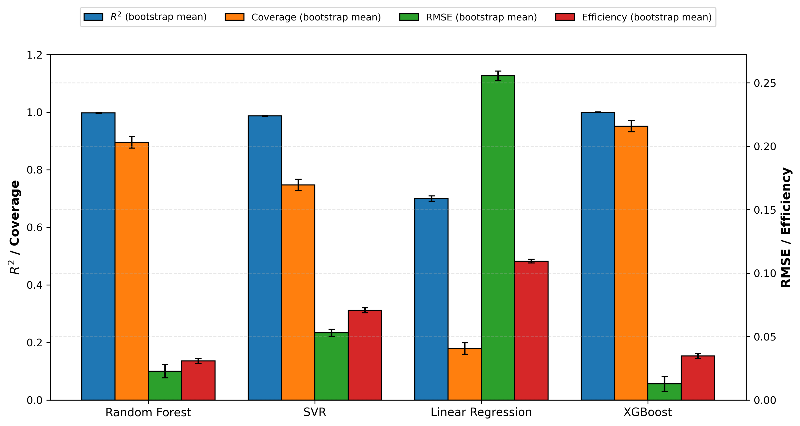
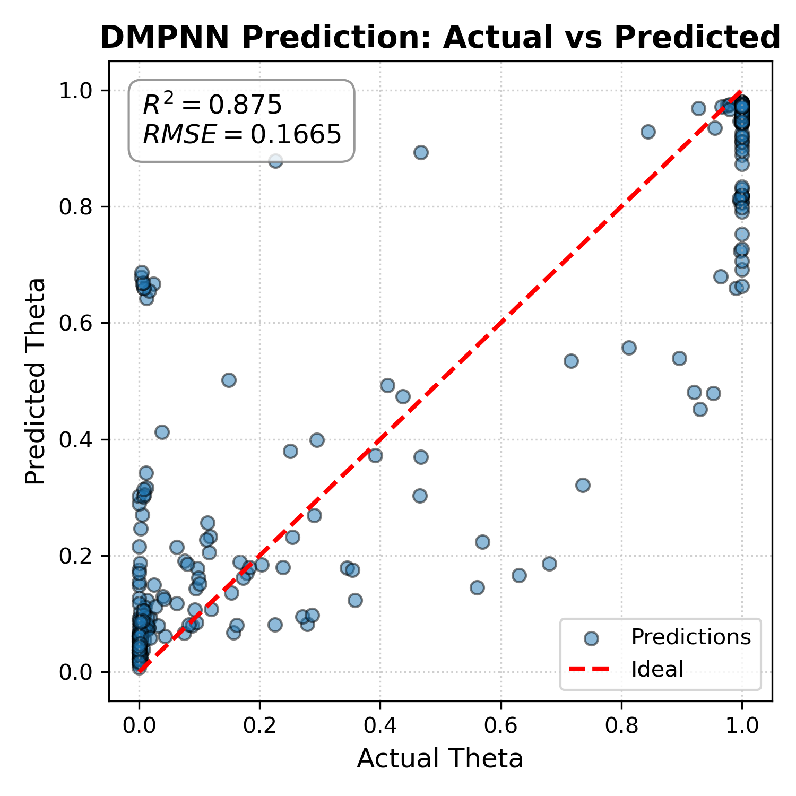

# SWCNT-H2-GNN

Machine learning and graph neural network workflows for predicting H2 adsorption on single-walled carbon nanotubes (SWCNTs). The repository keeps the code, input data, dependency notes, and two representative model-result figures needed to reproduce the main workflow.

## Project Structure

```text
SWCNT-H2-GNN/
|-- src/
|   |-- conventional_ml/        # RF, SVR, Linear Regression, XGBoost
|   |-- gnn/                    # DeepChem DMPNN/GNN variants
|   `-- mlp/                    # Simple MLP baselines
|-- data/
|   |-- conventional/           # Feature tables for conventional ML
|   |-- gnn/                    # Structure CSVs and GNN target tables
|   |-- mlp/                    # MLP target tables
|   `-- experimental/           # Experimental/calibration CSVs
|-- scripts/
|   |-- calibration/            # wt/V and experimental plot scripts
|   `-- validation/             # Group/split-check scripts
|-- requirements/               # Existing dependency lists
`-- results/examples/           # One conventional ML figure and one GNN figure
```

## Environment

```bash
python -m venv .venv
.venv\Scripts\activate
pip install -r requirements/conventional_ml.txt
pip install -r requirements/dcgnn.txt
```

DeepChem, RDKit, PyTorch, PyG/DGL can be platform-sensitive. If install fails, install those packages with the versions/channel used by your local or HPC environment, then rerun the same scripts.

## Data

- `data/conventional/dataset_full_feat.csv`: main feature table for conventional ML.
- `data/gnn/*/dataset_form*.csv`: target/global-feature tables for GNN variants.
- `data/gnn/*/data_prepare/*.csv`: atom coordinate/element tables used to build graph inputs.
- `data/experimental/*.csv`: calibration and experimental comparison inputs.

Large manuscript files, LaTeX build files, model caches, trained weights, and full generated result folders are not included.

## Recommended Run Order

1. Create the environment and install dependencies.

```bash
python -m venv .venv
.venv\Scripts\activate
pip install -r requirements/conventional_ml.txt
pip install -r requirements/dcgnn.txt
```

2. Run the conventional ML baseline first. This compares Random Forest, SVR, Linear Regression, and XGBoost using `data/conventional/dataset_full_feat.csv`.

```bash
python src/conventional_ml/MLs.py
```

Optional conventional checks:

```bash
python src/conventional_ml/MLs_overfitting_check.py
python scripts/validation/MLs_group_split_check.py
```

3. Run the main GNN model next: graph + temperature/pressure + TDA features.

```bash
python src/gnn/graph_tp_tda/dc_gnn_graph_tp_tda.py
```

Optional GNN variants:

```bash
python src/gnn/graph_tp/dc_gnn_graph_tp.py
python src/gnn/graph_tda/dc_gnn_graph_tda.py
python src/gnn/graph_44/dc_gnn_graph.py
python scripts/validation/dc_gnn_graph_tp_tda_split_check.py
```

4. Run optional MLP baselines only after the main conventional/GNN workflow.

```bash
python src/mlp/mlp_TP.py
python src/mlp/mlp_TDA.py
```

5. Run optional experimental/calibration helpers.

```bash
python scripts/calibration/wt_cal.py
python scripts/calibration/draw_experimental_plot.py
```

Generated outputs are written under `results/` and ignored by git, except the curated files in `results/examples/`.

## Model Results

### Conventional ML

The figure below comes from `conventional_ml/phys_T,P_TDA_random` and compares the four conventional regressors in one shared format.



### GNN / DMPNN

The figure below comes from `dc_gnn/graph_T,P_TDA` and reports measured vs predicted adsorption for the graph + T/P + TDA model.



## Main Files

- `src/conventional_ml/MLs.py`: conventional RF/SVR/LR/XGBoost comparison across feature modes.
- `src/conventional_ml/MLs_overfitting_check.py`: repeated-CV overfitting check and uncertainty plots.
- `src/gnn/graph_tp_tda/dc_gnn_graph_tp_tda.py`: main DMPNN run using graph, temperature/pressure, and TDA features.
- `scripts/validation/*`: group/split-check scripts.
- `scripts/calibration/*`: experimental calibration and plotting helpers.

## Notes

- `src/gnn/graph_1500/dc_gnn_graph.py` was removed by request; the `graph_1500` data remains for reference.
- DeepChem dataset caches and trained weights are not uploaded; rerun scripts to regenerate them.
- `src/mlp/mlp_TDA.py` currently selects 15 TDA features but defines `nn.Linear(2, 64)`. This known original-code bug was not fixed during cleanup.
- `scripts/calibration/v_cal.py` references `data/experimental/for_experimental_data.csv`, which was not present in the scanned folders.
