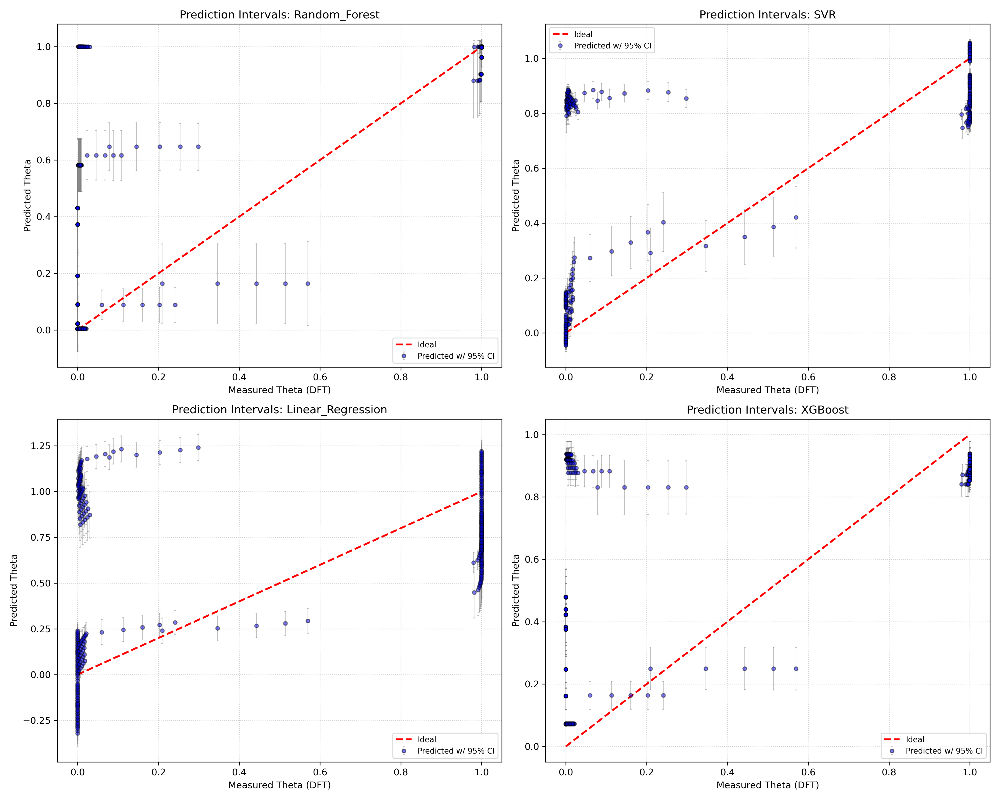
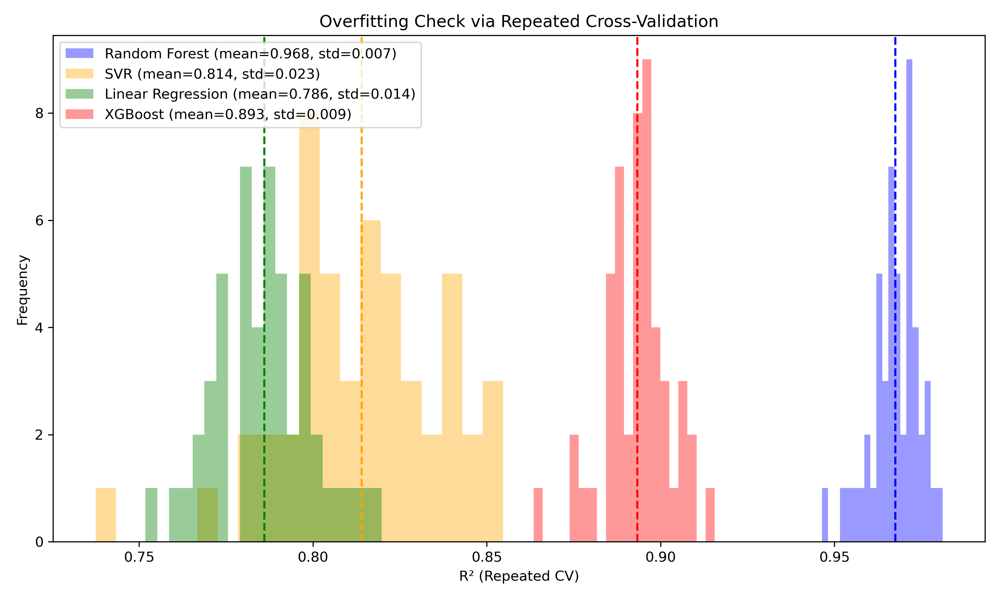
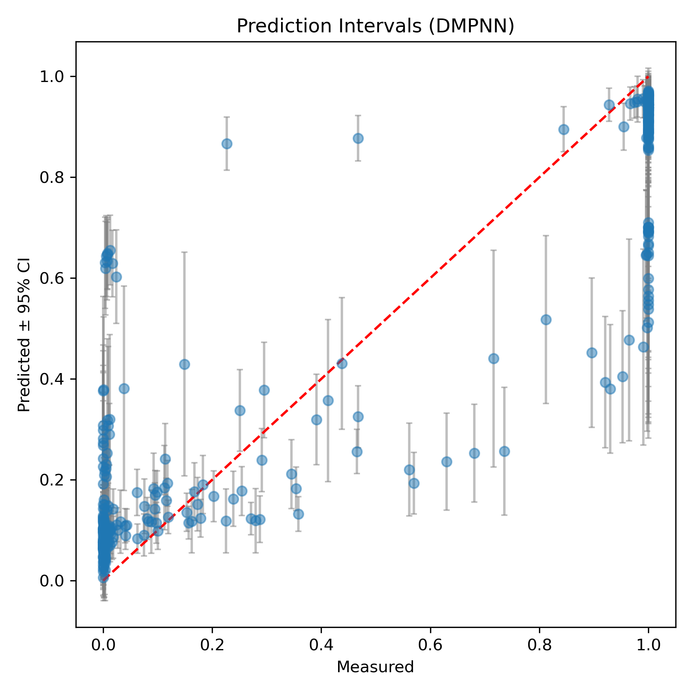
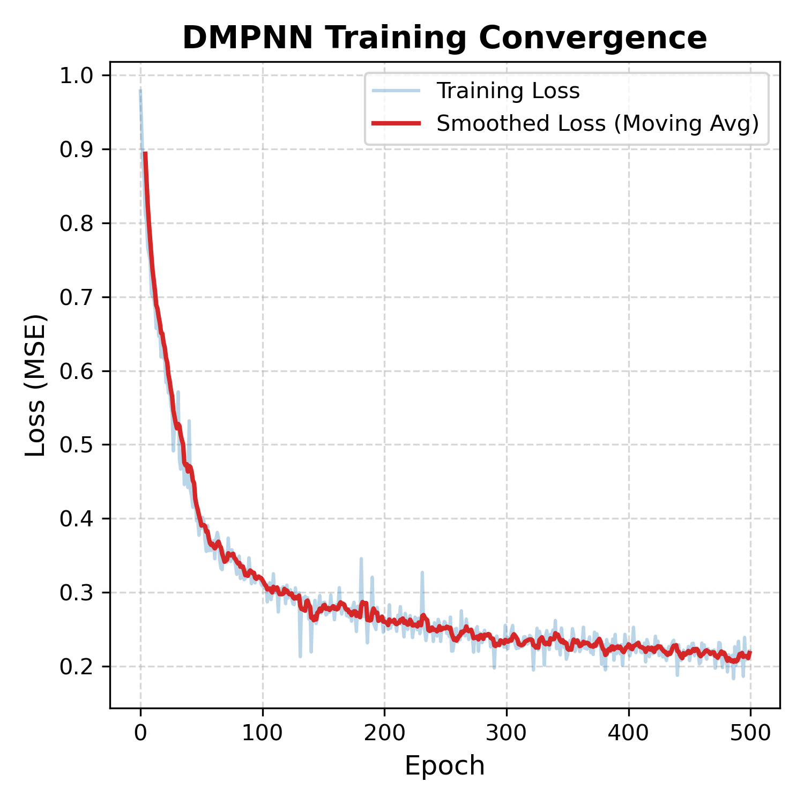
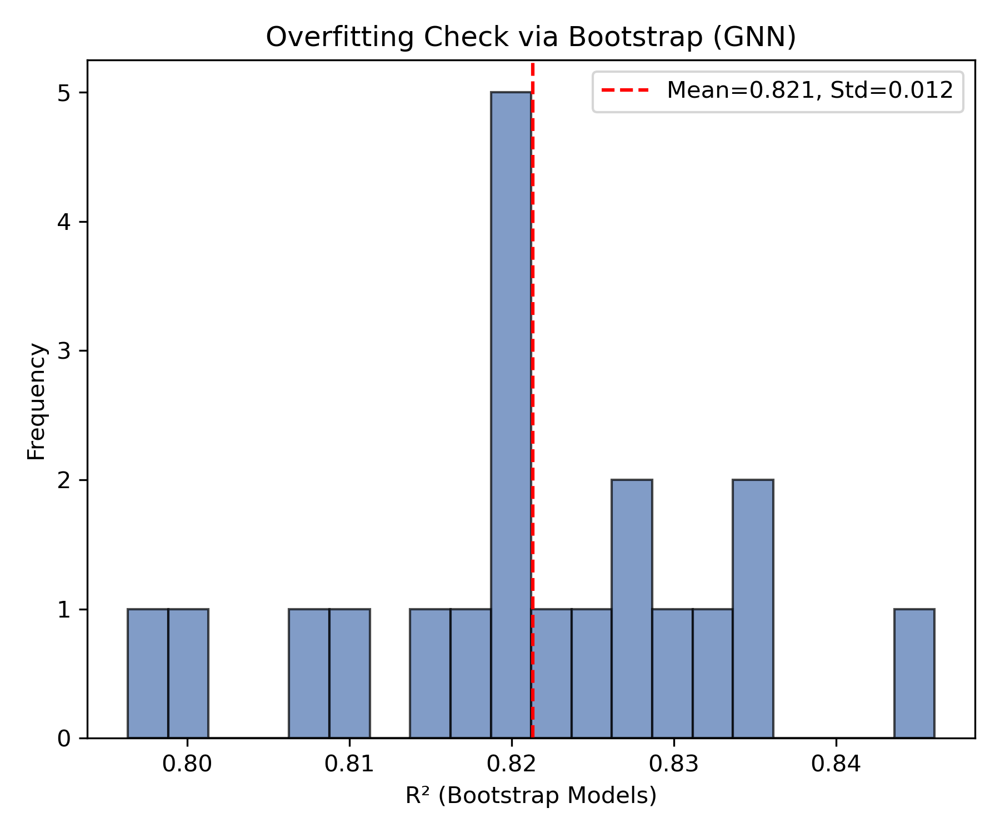
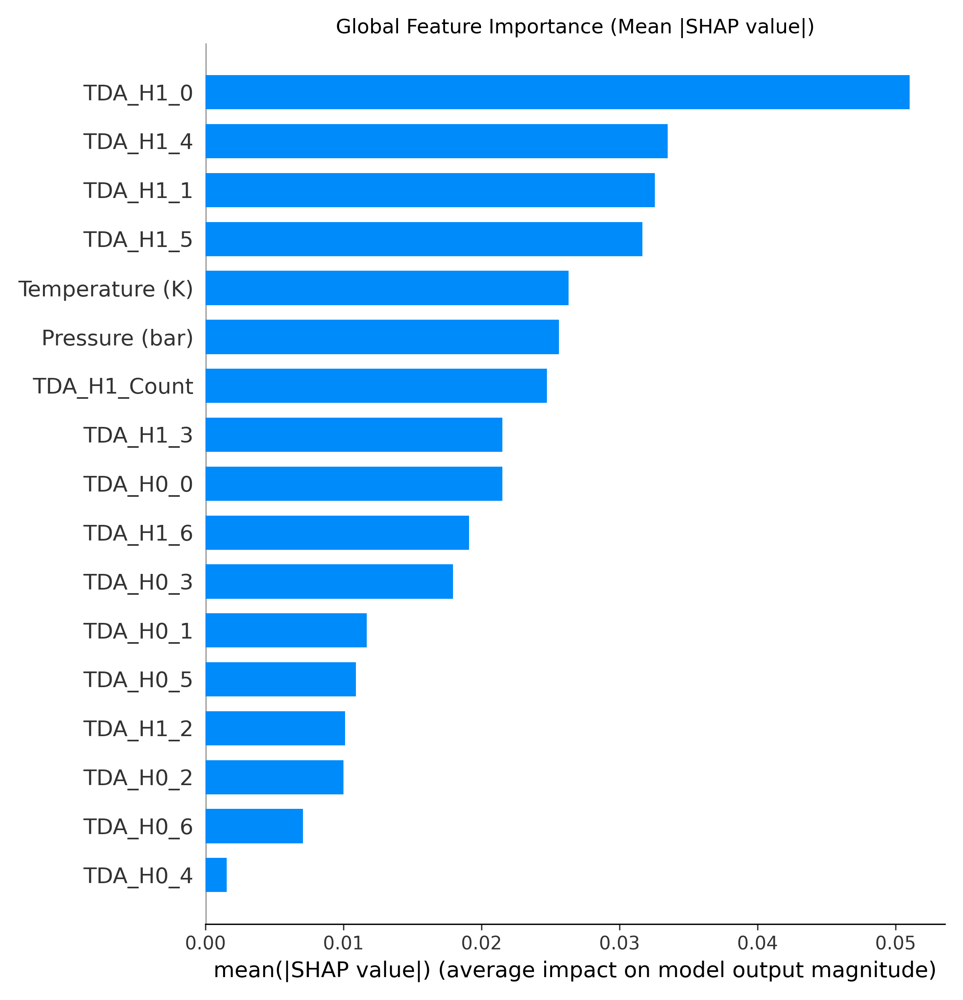

# SWCNT-H2-GNN

Machine learning and graph neural network workflows for predicting H2 adsorption on single-walled carbon nanotubes (SWCNTs). The project includes conventional ML baselines, DeepChem DMPNN/GNN experiments, TDA/global-feature variants, calibration scripts, cleaned input data, and a small set of example outputs.

## Project Structure

```text
SWCNT-H2-GNN/
|-- src/
|   |-- conventional_ml/        # RF, SVR, linear regression, XGBoost scripts
|   |-- gnn/                    # DeepChem DMPNN/GNN variants
|   `-- mlp/                    # Simple MLP baselines
|-- data/
|   |-- conventional/           # Feature tables for conventional ML
|   |-- gnn/                    # Structure CSVs and GNN target tables
|   |-- mlp/                    # MLP target tables
|   `-- experimental/           # Experimental/calibration CSVs
|-- scripts/
|   |-- calibration/            # wt/V and experimental plot scripts
|   `-- validation/             # Group/split-check scripts from writing project
|-- requirements/               # Existing dependency lists
|-- docs/                       # Legacy notes, summary table, refs.bib
`-- results/examples/           # Curated example plots and PDB importance maps
```

## Environment

Use the existing requirement files. No new dependencies were added during cleanup.

```bash
python -m venv .venv
.venv\Scripts\activate
pip install -r requirements/conventional_ml.txt
pip install -r requirements/dcgnn.txt
```

DeepChem, RDKit, PyTorch, PyG/DGL stacks can be platform-sensitive. If pip install fails, install those packages with the versions/channel used by your local or HPC environment, then rerun the same scripts.

## Data Preparation

The repository includes the CSV inputs needed by the copied scripts:

- `data/conventional/dataset_full_feat.csv`: main feature table for conventional ML.
- `data/gnn/*/dataset_form*.csv`: target/global-feature tables for GNN variants.
- `data/gnn/*/data_prepare/*.csv`: atom coordinate/element tables used to build graph inputs.
- `data/experimental/*.csv`: calibration and experimental comparison inputs.

Large manuscript PDFs, Word files, LaTeX build files, full figure dumps, caches, and generated model outputs were not copied.

## Run Commands

Conventional ML:

```bash
python src/conventional_ml/MLs.py
python src/conventional_ml/MLs_overfitting_check.py
python scripts/validation/MLs_group_split_check.py
```

GNN variants:

```bash
python src/gnn/graph_tp_tda/dc_gnn_graph_tp_tda.py
python src/gnn/graph_tp/dc_gnn_graph_tp.py
python src/gnn/graph_tda/dc_gnn_graph_tda.py
python src/gnn/graph_44/dc_gnn_graph.py
python scripts/validation/dc_gnn_graph_tp_tda_split_check.py
```

MLP baselines:

```bash
python src/mlp/mlp_TP.py
python src/mlp/mlp_TDA.py
```

Experimental/calibration scripts:

```bash
python scripts/calibration/wt_cal.py
python scripts/calibration/draw_experimental_plot.py
```

Generated outputs are written under `results/` and ignored by git, except the curated files in `results/examples/`.

## Model Performance

The curated figures below use a consistent reporting format so the model families can be compared without opening the raw result folders.

### Conventional ML

Four conventional regressors are compared together in the same figures: Random Forest, SVR, Linear Regression, and XGBoost.

| View | Figure |
| --- | --- |
| Metrics summary |  |
| Prediction intervals |  |
| Overfitting check |  |

### GNN / DMPNN

The GNN scripts follow the same output pattern across feature variants: graph-only, graph + T/P, graph + TDA, and graph + T/P + TDA. The example figures below are from the curated GNN output set.

| View | Figure |
| --- | --- |
| Measured vs predicted |  |
| Prediction interval |  |
| Learning curve |  |
| Overfitting check |  |
| Feature importance |  |

## Main Files

- `src/conventional_ml/MLs.py`: conventional RF/SVR/LR/XGBoost comparison across feature modes.
- `src/conventional_ml/MLs_overfitting_check.py`: repeated-CV overfitting check and uncertainty plots.
- `src/gnn/graph_tp_tda/dc_gnn_graph_tp_tda.py`: main DMPNN run using graph, temperature/pressure, and TDA features.
- `src/gnn/graph_1500/dc_gnn_graph.py` was removed from this cleaned repo by request.
- `scripts/validation/*`: group/split-check versions from the writing project.
- `scripts/calibration/*`: experimental calibration and plotting helpers.
- `results/examples/`: small representative plots/PDB outputs for inspection.

## Notes

- The original working folder was not deleted or modified.
- Only selected example figures were copied; full generated figure folders are intentionally excluded.
- DeepChem dataset caches and trained weights are not uploaded; rerun scripts to regenerate them.
- `src/mlp/mlp_TDA.py` currently selects 15 TDA features but defines `nn.Linear(2, 64)`. That is a known code bug in the original logic and was not fixed during cleanup.
- `scripts/calibration/v_cal.py` references `data/experimental/for_experimental_data.csv`, which was not present in the scanned folders.


